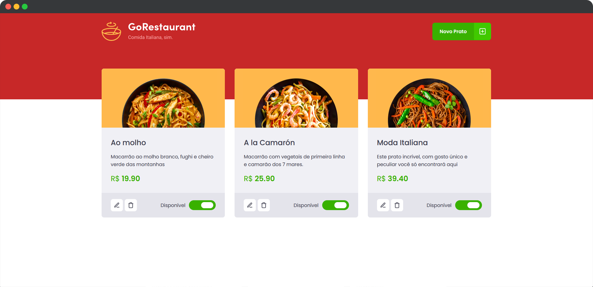

<h1 align="center">
  
</h1>

<p align="center">
  

  
</p>

<br>

<p align="center">
  
</p>

<br>

## 🧪 Tecnologias

Esse projeto foi desenvolvido com as seguintes tecnologias:

- [React](https://reactjs.org)
- [JSON Server](https://github.com/typicode/json-server)
- [TypeScript](https://www.typescriptlang.org/)

## 💻 Projeto

GoRestaurant foi desenvolvido com o objetivo de colocar em prática os conceitos relacionados a refatoramento de classes para funções e de Javascript para Typescript.

Este é um projeto desenvolvido como prática das aulas do Chapter II da trilha ReactJS do **[Programa Ignite](https://www.rocketseat.com.br/ignite)** da Rocketseat.

## 🚀 Como executar

Clone o projeto e acesse a pasta do mesmo.

```bash
$ git clone https://github.com/rafaelramosdev/go-restaurant
$ cd go-restaurant
```

Para iniciá-lo, siga os passos abaixo:

```bash
# Instala as dependências
$ yarn

# Inicia o json-server
$ yarn server

# Inicia o website
$ yarn start
```

O website estará disponível no seu navegador pelo endereço [`http://localhost:3000`](http://localhost:3000).

## 📄 Licença

Esse projeto está sob a licença MIT. Veja o arquivo [LICENSE](LICENSE) para mais detalhes.

---

Feito by [Rafael Ramos](https://rafaelramos.dev/) 🙋🏻‍♂️
